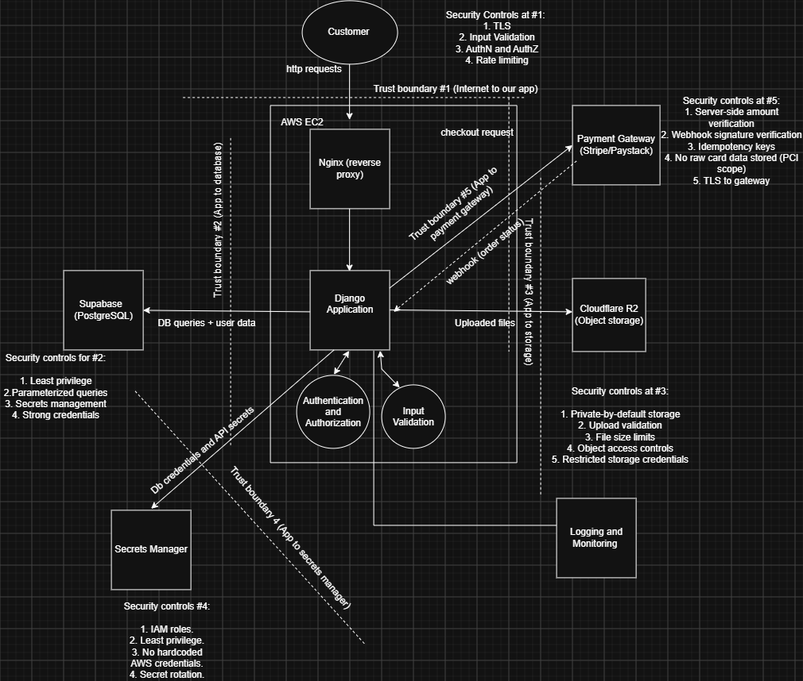

# E-Commerce Application Threat Model

A standalone application security threat model for a fictional e-commerce platform (Django, AWS EC2, Supabase, Cloudflare R2, and a third-party payment gateway). This project documents the system through a data flow diagram (DFD) with explicit trust boundaries, then applies a structured threat modeling framework to each boundary.

This repo is scoped to the threat modeling phase only — architecture design and analysis, not implementation. It exists as a standalone artifact to demonstrate the process independent of the build.

## Methodology

1. **Architecture mapping** — every component, data store, and external dependency was mapped into a DFD.
2. **Trust boundary identification** — five boundaries were identified, each representing a point where data crosses between zones of differing trust.
3. **Six-question threat analysis**, applied per boundary:
   - What is at risk?
   - Who could exploit it?
   - Why would they do it?
   - How could it realistically happen?
   - Which components carry the greatest risk?
   - Which security controls reduce that risk?

## Contents

- [`dfd.drawio`](./dfd.drawio) — editable source diagram
- [`dfd.png`](./dfd.png) — exported diagram (see below)
- [`threat-model.md`](./threat-model.md) — full write-up

## Diagram

## Trust Boundaries Covered

| # | Boundary | Crossing |
|---|----------|----------|
| 1 | Internet → App | User traffic through Nginx to the Django app on EC2 |
| 2 | App → Database | Django to Supabase (Postgres + auth) |
| 3 | App → Object Storage | Django to Cloudflare R2 |
| 4 | App → Secrets | Django to secrets manager |
| 5 | App → Payment Gateway | Django to Stripe/Paystack |

See [`threat-model.md`](./threat-model.md) for the full analysis of each.
